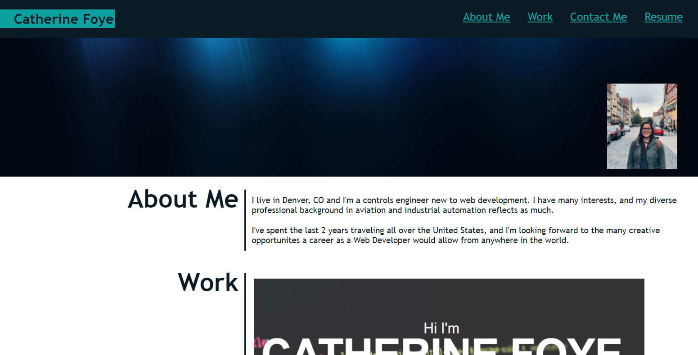

# Portfolio

  

     
    <h2 align="center"><a href="https://github.com/cdfoye/Portfolio"><strong>Explore the docs »</strong></a></h2>
     
    <h2 align="center"><a href=" https://cdfoye.github.io/Portfolio/">View Demo »</strong></a></h2>
     
     
  

<!-- PROJECT DESCRIPTION -->
<h1 align="center"> Project Description</h1>

This project was intended to create my portfolio that highlights my projects so far. It includes an about me section, a link to my resume, as well as different methods of contacting me. The goal is to continue updating my portfolio as the bootcamp and my skills progress. I used HTML and CSS to create and style the project.

 
 

<!-- ABOUT THE PROJECT -->
<h1 align="center"> About The Project</h1>

The following is an image of the portfolio:

 

